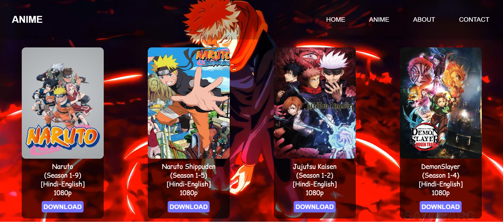
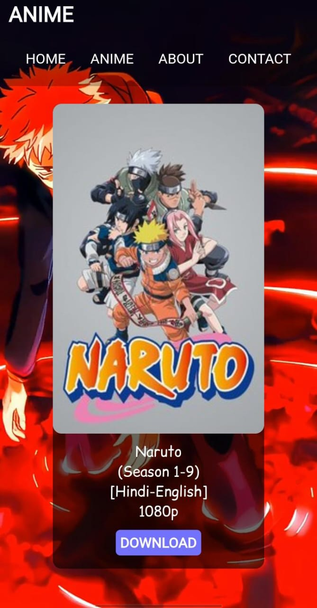

<h1 align="center">🔥 My Anime Web 😎</h1>

<p align="center">
  A beautifully crafted anime-themed responsive website built with 💻 HTML, & 🎨 CSS,
  <br>
  Perfect for anime fans and frontend learners!
</p>

---

## 🔥 Features

- ✨ Stunning Anime UI  
- 📱 Mobile Responsive Layout  
- 💫 Smooth Hover Effects  
- 🧼 Clean Code Structure  
- 🎯 Beginner Friendly  

---

## 🌐 Live Demo

🔗 [**Click here to view the live website**](https://ammarmarediya.github.io/My-Anime-Web/)  


---

## 🛠️ Tech Stack

| Tech   | Role               |
|--------|--------------------|
| HTML5  | Structure & Markup |
| CSS3   | Layout & Design    |

---

## 📸 Screenshots

<div align="center">




</div>

<p align="center"><i>Left: Desktop View | Right: Mobile View</i></p>

---

## 🚀 How to Run Locally

```bash
git clone https://github.com/AmmarMarediya/My-Anime-Web.git
cd My-Anime-Web
# Then open index.html in your browser
